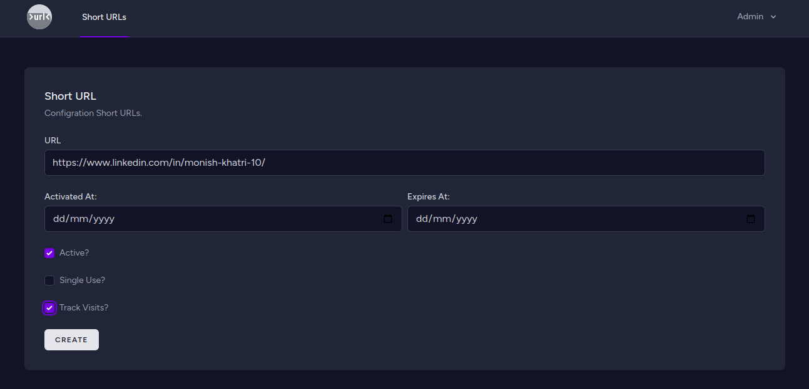
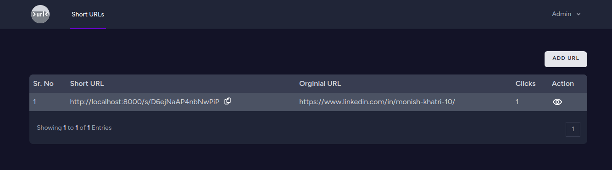
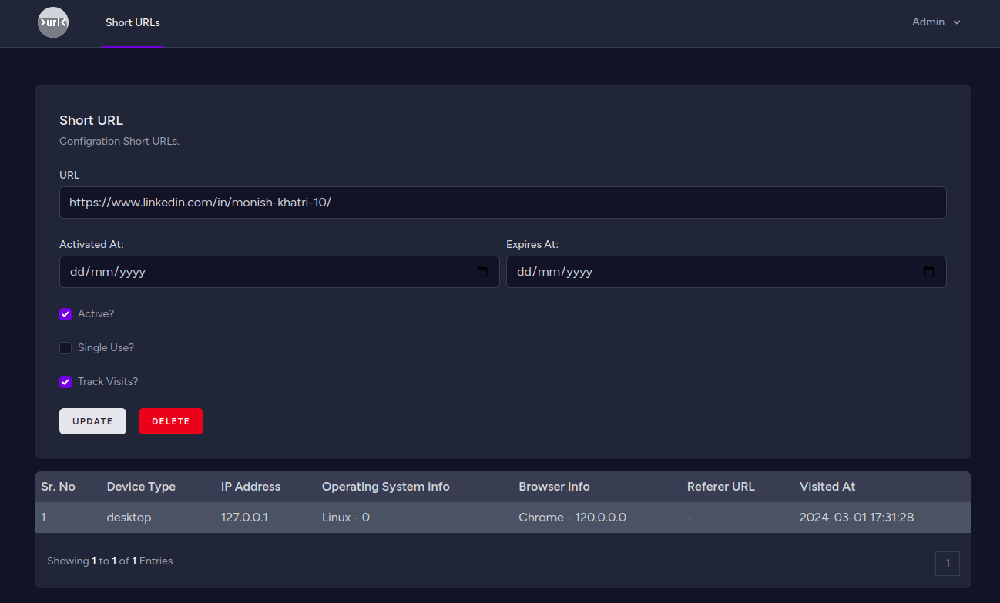

# URL Shortener
This project is a URL shortener built using the Laravel framework along with Vue.js for frontend interactivity and Inertia.js for seamless server-side rendering. The URL shortener allows users to shorten long URLs into more manageable ones and provides additional features such as creating single-use URLs, setting activation and expiration times, and tracking various information about the shortened URLs like IP addresses, browser info, device, referral URLs, and visit timestamps.

## Preview

## Technology Requirements
- Laravel (>= 8.x)
- Vue.js (>= 2.x)
- Inertia.js (>= 0.10.x)
- PHP (>= 7.4)
- MySQL or any compatible database
- Node.js (>= 12.x)
- Composer

## Setup Steps
- Clone the Repository:
    - `git clone https://github.com/your/repository.git`
- Navigate to the Project Directory:
    - `cd url-shortner`
- Install PHP Dependencies:
    - `composer install`
- Install Node.js Dependencies:
    - `npm i`
- Create a Copy of the .env File:
    - `cp .env.example .env`
- Generate an Application Key:
    - `php artisan key:generate`
- Update Database Configuration in .env File:
- Update the database connection settings in the .env file with your database credentials.

- Run Database Migrations:
    - `php artisan migrate`
- Compile Frontend Assets:
    - `npm run dev`
- Start the Development Server:
    - `php artisan serve`
- Access the Application:
    - Visit http://localhost:8000 in your browser.

## Features
### Shorten URL
- Users can shorten long URLs to more manageable ones.
### Single-Use URL
- Users can generate single-use URLs, which become invalid after the first visit.
### Activation Time and Expiry Time
- Users can set activation and expiry times for the shortened URLs.
- The shortened URLs become active only after the specified activation time and become invalid after the expiry time.
### Traceable URL
- The system tracks various information about the shortened URLs:
- IP address of the visitor.
- Operating System of the visitor.
- Browser information of the visitor.
- Device information of the visitor.
- Referral URL from which the visitor accessed the shortened URL.
- Timestamp of the visit.

### Analytics
- Users can view analytics such as the number of visits, geographical locations of visitors, etc., for each shortened URL.

## Contributors
[Monish Khatri](https://github.com/monish-khatri)

## License
URL Shortner is open-sourced software licensed under the [MIT license](LICENSE.md).
